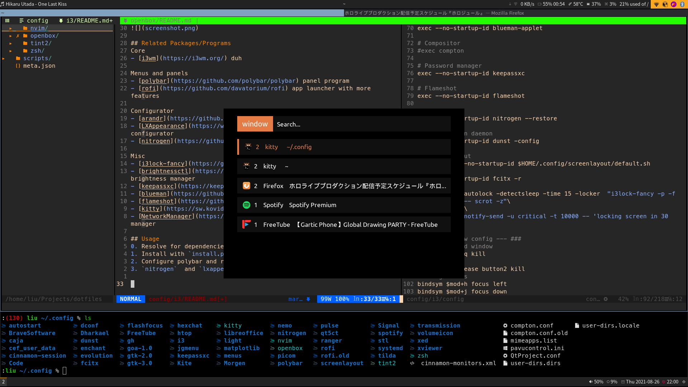

My personal openbox setup

## Related Packages/Programs
Core
- [i3wm](https://i3wm.org/) duh

Menus and panels
- [polybar](https://github.com/polybar/polybar) panel program
- [rofi](https://github.com/davatorium/rofi) app launcher with more features

Configurator
- [arandr](https://github.com/haad/arandr) GUI xrandr configurator
- [LXAppearance](https://wiki.lxde.org/en/LXAppearance) GTK theme configurator
- [nitrogen](https://github.com/l3ib/nitrogen) wallpaper configurator

Misc
- [i3lock-fancy](https://github.com/meskarune/i3lock-fancy) fancier i3lock
- [brightnessctl](https://github.com/Hummer12007/brightnessctl) screen brightness manager
- [keepassxc](https://keepassxc.org/) password manager
- [blueman](https://github.com/blueman-project/blueman) bluetooth manager
- [flameshot](https://github.com/flameshot-org/flameshot) screenshot daemon
- [kitty](https://sw.kovidgoyal.net/kitty/) feature-rich terminal emulator
- [NetworkManager](https://wiki.gnome.org/Projects/NetworkManager) wifi manager
- [xautolock](https://linux.die.net/man/1/xautolock) inactivity autolock
- [dunst](https://dunst-project.org/) notification daemon
- (Optional) enable icon showing in title bar, use [i3-wm-iconpatch](https://aur.archlinux.org/packages/i3-wm-iconpatch/). 
For non-Arch system, download the current working patch by clicking "Download Tarball" on the right-hand side of the AUR page.
Extract and navigate to the root of the i3 source directory and run `patch -p1 < /path/to/patch/file`
## Usage
0. Resolve for dependencies
1. Install with `install.py`
2. Configure **arandr** (`config/screenlayout`) **polybar**, **dunst** and **rofi** in their respective dir
3. `nitrogen`  and `lxappearance` to configure extra appearance

Beware that there are a lot of new and different settings from default i3 settings, listed below
- `mod` key is `<meta>`
- Default window config is tabbed
- Arrow key related bahavior all disabled to strictly use `<h/j/k/l>`
- Screen brightness keys use intel settings as default and 2% step
- Volume keys use 2% step & media key support
- `<mod-p>` launches Keepassxc
- `<mod-w>` launches Firefox
- `<mod-a>` launches PulseAudio GUI configurator
- `<mod-shift-s>` launches Flameshot 
- ``<mod-`>`` launch rofi, dmenu is disabled
- `<mod-x>` gives prompt for power options
- Autolock at 15 min with a 30 sec pre-warning msg
- `<mod-q>` to close window
- `<mod-s/t/e>` changes layout to stacked/tabbed/split respectively
- `<mod-v>` gives verticle orientation, `<mod-Shift-v>` gives horitonzal orientation
- `<mod-r>` to resize window, after which use `<h/j/k/l>` to resize
- `<mod>+mouse` to drag floating windows to move
- `<mod+d>` to displace floating windows, during which `<h/j/k/l>` to relocate, `<mod+tab>` to switch different floating windows

