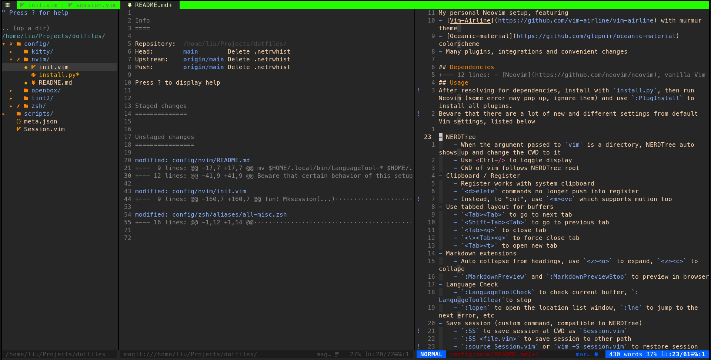

My personal Neovim setup, featuring
- [Vim-Airline](https://github.com/vim-airline/vim-airline) with murmur theme
- [Oceanic-material](https://github.com/glepnir/oceanic-material) colorscheme
- Many plugins, integrations and convenient changes



## Dependencies
- [Neovim](https://github.com/neovim/neovim), vanilla Vim should also work but not tested.
- [vim-plug](https://github.com/junegunn/vim-plug)
- Python3 with [pynvim](https://github.com/davidhalter/jedi)
- [LanguageTool](http://www.languagetool.org/download/). 
Unzip a package to `~/.local/bin/LanguageTool`, or use the following commands

```bash
wget https://languagetool.org/download/LanguageTool-stable.zip
unzip LanguageTool-stable.zip -d $HOME/.local/bin/
mv $HOME/.local/bin/LanguageTool-* $HOME/.local/bin/bin/LanguageTool
```

## Usage
After resolving for dependencies, install with `install.py`, then run Neovim (some error may pop up, ignore them) and use `:PlugInstall` to install all plugins.
Beware that there are a lot of new and different settings from default Vim settings, listed below

- NERDTree
    - When the argument passed to `vim` is a directory, NERDTree auto shows up and change the CWD to it
    - Use <Ctrl-/> to toggle display
    - CWD of vim follows NERDTree root
- Clipboard / Register
    - Register works with system clipboard
    - `<d>elete` commands no longer push into register
    - Instead, to "cut", use `<m>ove` which supports motion too
- Use tabbed layout for buffers
    - `<Tab><Tab>` to go to next tab
    - `<Shift-Tab><Tab>` to go to previous tab
    - `<Tab><q>` to close tab
    - `<\><Tab><q>` to force close tab
    - `<Tab><t>` to open new tab
- Markdown extensions
    - Auto collapse from headings, use `<z><o>` to expand, `<z><c>` to collape
    - `:MarkdownPreview` and `:MarkdownPreviewStop` to preview in browser
- Language Check
    - `:LanguageToolCheck` to check current buffer, `:LanguageToolClear`to stop
    - `:lopen` to open the location list window, `:lne` to jump to the next error, etc
- Save session (custom command, compatible to NERDTree)
    - `:SS` to save session at CWD as `Session.vim`
    - `:SS <file.vim>` to save session to other path
    - `:source Session.vim` or `vim -S session.vim` to restore session
- Git integration
    - `:Magit` to use prompted git diff, stage, commit tool
    - `<Ctrl-n>`/`<Ctrl-p>` to navigate hunks
    - `S` to stage changes
    - `CC` -> write msg -> `CC` to commit changes
    - `:Git push` and other commands provided by [vim-fugitive](https://github.com/tpope/vim-fugitive)
- Misc QoL
    - Quick comment/uncomment with `<\><cc>`, `<\><cu>`
    - Behavior of `<;>` and `<;>` swapped for faster command input
    - Search is case incensitive, except for when uppercase is included (`smartcae`)
    - `<Space><Space>`(double tap space) to quick swtich to the next buffer
    - All indentation configured to 4 spaces
    - Line numbers use differential representation relative to the cursor, only in normal mode in the active buffer
    - Autocomplete shows up at the bottom of the word in insert mode. Use `<Tab>` to go through them.
    - Indentation shows a suble guideline, use `<\><i><g>` to toggle it
