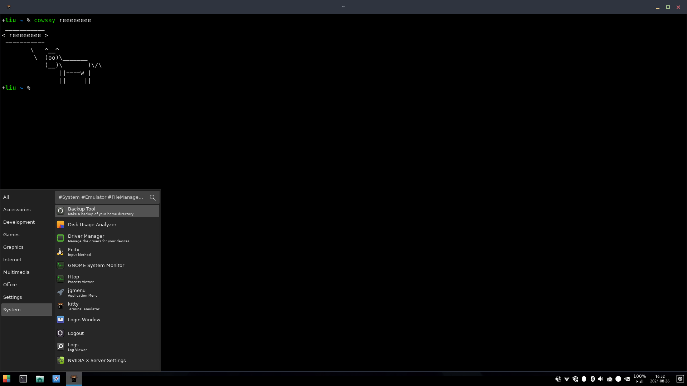

My personal openbox setup

## Related Packages/Programs
Core
- [Openbox](http://openbox.org/wiki/Main_Page)

Configurator
- [obconf](http://openbox.org/wiki/ObConf:About) openbox GUI configurator
- [LXAppearance](https://wiki.lxde.org/en/LXAppearance) GTK theme configurator

Menus and panels
- [tint2](https://gitlab.com/o9000/tint2) panel program
- [jgmenu](https://github.com/johanmalm/jgmenu) menu-like app launcher
- [menumaker](http://menumaker.sourceforge.net/) generate menu items

Misc
- [brightnessctl](https://github.com/Hummer12007/brightnessctl) screen brightness manager
- [nitrogen](https://github.com/l3ib/nitrogen) wallpaper configurator
- [volumeicon](https://github.com/Maato/volumeicon) or `volumeicon-alsa` in Debian apt sources, this is a volumeicon that works with alsa at panel tray
- [keepassxc](https://keepassxc.org/) password manager
- [blueman](https://github.com/blueman-project/blueman) bluetooth manager
- [flameshot](https://github.com/flameshot-org/flameshot) screenshot daemon
- [kitty](https://sw.kovidgoyal.net/kitty/) feature-rich terminal emulator
- [NetworkManager](https://wiki.gnome.org/Projects/NetworkManager) wifi manager

## Usage
0. Resolve for dependencies
1. Install with `install.py`
2. `nitrogen`, `obconf` and `lxappearance` to configure appearance
3. `mmaker openbox -f -t kitty` to generate menu
4. Install config for tint2
5. Configure jgmenu with `jgmenu_run init -i`
5. Lastly, install the power menu script in `scripts/tintlogout`

